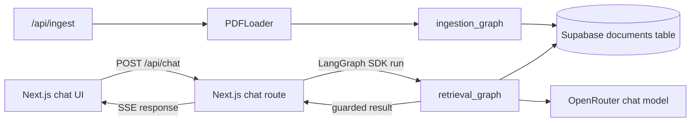
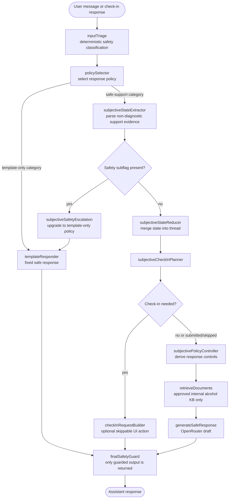

# Recovery Support Assistant

A safety-aware alcohol-recovery support application built with Next.js,
LangChain, LangGraph, Supabase, and OpenRouter.

The application is designed for supportive conversations about alcohol
cravings, lapses, recovery, grounding, and safer next steps. It is not a
clinician, therapist, emergency service, or medical device.

## What the application does

- Classifies incoming messages with deterministic safety rules.
- Uses fixed responses for urgent, medical, medication, detox, unsafe-alcohol,
  prompt-injection, and out-of-scope requests.
- Uses an approved internal alcohol-support knowledge base for safe-support
  conversations.
- Generates a response draft with an OpenRouter-hosted chat model only after
  safety triage and approved retrieval.
- Runs every user-visible response through a final rule-based safety guard.
- Offers an optional, skippable subjective check-in for safe-support
  conversations.
- Displays approved support-source metadata when documents were retrieved.

The assistant must not provide diagnosis, clinical scores, CIWA/withdrawal
scoring, medication or dosage advice, detox instructions, treatment plans, or
unsafe alcohol-use guidance.

## Architecture

The main request and ingestion boundaries are:



The retrieval graph itself is safety-gated before any external retrieval or
model generation:



The backend exposes two LangGraph graphs through `backend/langgraph.json`:

- `retrieval_graph` — the live alcohol-support conversation flow.
- `ingestion_graph` — PDF parsing and vector-store ingestion for controlled
  indexing workflows.

The current chat UI uses the curated internal alcohol KB. The PDF ingestion
endpoint remains available for developer-controlled indexing, but arbitrary
uploaded PDFs are not used as the normal chat grounding source. Retrieval
filters require all of the following metadata:

```json
{
  "source": "internal_kb",
  "substance": "alcohol",
  "userVisible": true,
  "approved": true,
  "riskCategory": "alcohol_craving | lapse_or_relapse | general_support"
}
```

## Repository layout

```text
backend/
  src/retrieval_graph/       LangGraph conversation flow
  src/ingestion_graph/       Document ingestion graph
  src/safety/                Triage, policies, templates, final guard
  src/subjective/            Check-in types, extraction, planning, reduction
  src/kb/                    KB filters and alcohol-support seed documents
  scripts/                   Developer utilities, including KB seeding

frontend/
  app/page.tsx               Chat interface
  app/api/chat/              Chat proxy and SSE response route
  app/api/ingest/            PDF ingestion route
  components/                Chat, check-in, source, and UI components
  lib/                       LangGraph, PDF, and check-in helpers

docs/
  Phase 1 and Phase 2 runbooks, acceptance cases, and live checklists
```

## Requirements

- Node.js 18 or newer (Node.js 20 is recommended).
- Corepack-enabled Yarn.
- A LangGraph-compatible local or hosted backend runtime.
- A Supabase project with:
  - a `documents` table containing vector embeddings and metadata;
  - a `match_documents` RPC/function for similarity search.
- An OpenRouter API key.

LangSmith tracing is optional. The Supabase vector-store setup is described in
the [LangChain Supabase integration documentation](https://js.langchain.com/docs/integrations/vectorstores/supabase/).

## Installation

From the repository root:

```bash
corepack enable
corepack yarn install
```

Create environment files for the backend and frontend as described below.

## Environment variables

### Backend

Create `backend/.env`:

```dotenv
OPENROUTER_API_KEY=your-openrouter-api-key
SUPABASE_URL=https://your-project.supabase.co
SUPABASE_SERVICE_ROLE_KEY=your-supabase-service-role-key

# Optional LangSmith tracing
LANGCHAIN_TRACING_V2=false
LANGCHAIN_API_KEY=your-langsmith-api-key
LANGCHAIN_PROJECT=recovery-support-assistant
```

The backend uses OpenRouter for both the default chat model and embeddings:

- Chat model: `openrouter/openai/gpt-4o-mini`.
- Embeddings: `openai/text-embedding-3-small` through the OpenRouter API.

Keep `SUPABASE_SERVICE_ROLE_KEY` and all provider keys on the server. Do not
expose them through `NEXT_PUBLIC_*` variables.

### Frontend

Create `frontend/.env`:

```dotenv
NEXT_PUBLIC_LANGGRAPH_API_URL=http://localhost:2024
LANGGRAPH_RETRIEVAL_ASSISTANT_ID=retrieval_graph
LANGGRAPH_INGESTION_ASSISTANT_ID=ingestion_graph

# Optional API key for a hosted LangGraph/LangSmith deployment
LANGCHAIN_API_KEY=your-langsmith-api-key
```

`NEXT_PUBLIC_LANGGRAPH_API_URL` must point to the LangGraph server reachable by
the Next.js application. The chat route defaults to
`http://localhost:2024`, while the server-side LangGraph client expects this
variable to be present.

## Running locally

Start the LangGraph backend in one terminal:

```bash
cd backend
corepack yarn langgraph:dev
```

This serves the graphs on the default LangGraph development port,
`http://localhost:2024`.

Start the Next.js frontend in a second terminal:

```bash
cd frontend
corepack yarn dev
```

Open [http://localhost:3000](http://localhost:3000).

## Seeding the internal knowledge base

The repository includes 18 curated alcohol-support documents across the Phase 1
and Phase 2 KB versions. Seed them into Supabase from `backend/`:

```bash
corepack yarn tsx scripts/seedAlcoholKb.ts
```

The seed script removes existing `internal_kb` alcohol rows for the managed KB
versions before inserting the current seed documents. Run it only against the
intended Supabase project.

## Using the application

The main UI is a chat experience. Example supported inputs include:

- “I really want a drink right now.”
- “I slipped and drank last night.”
- “I had a long day and I’m worried I drink too much.”
- “Help me choose one safe next step.”

For safe-support messages, the assistant may present an optional inline
check-in. The check-in can ask about current craving, distress, coping
confidence, alcohol availability, recent use, social context, or preferred
support style. It can always be skipped.

Urgent or unsafe messages use deterministic templates and do not call the
retriever or chat model. For example, requests involving self-harm, intoxicated
driving, possible medical emergencies, withdrawal concerns, medication/dosage,
alcohol-medication mixing, or hiding drinking are routed away from normal
support generation.

The frontend keeps the active thread ID and conversation state through the
LangGraph thread. It does not provide application-level user authentication or
its own conversation database.

## PDF ingestion

The backend still contains a controlled ingestion path:

```text
PDF upload
→ frontend /api/ingest route
→ PDFLoader extraction
→ ingestion_graph
→ Supabase embeddings
```

The route accepts up to five PDF files, each no larger than 10 MB. It creates a
thread for the ingestion batch and attaches that thread ID to document
metadata. The current retrieval graph intentionally restricts chat retrieval
to approved internal alcohol-support documents, so this ingestion path should
be treated as developer/indexing infrastructure rather than a user-uploaded
document chat feature.

## Validation

From the repository root:

```bash
corepack yarn build
corepack yarn lint
corepack yarn format:check
```

Backend deterministic Phase 1 and Phase 2 validation:

```bash
cd backend
corepack yarn test:phase1
corepack yarn test:phase2
corepack yarn tsc --noEmit
```

Run the complete backend Jest suite with:

```bash
corepack yarn test
```

Some backend integration cases are environment-gated and require live
Supabase/provider credentials. The frontend ingestion integration suite expects
a running Next.js server at `http://localhost:3000`.

## Deployment

Deploy the LangGraph backend using the LangGraph hosting/self-hosting approach
appropriate for your environment, then deploy the Next.js frontend to a
Next.js-compatible host.

Configure at minimum:

- Backend: `OPENROUTER_API_KEY`, `SUPABASE_URL`,
  `SUPABASE_SERVICE_ROLE_KEY`.
- Frontend: `NEXT_PUBLIC_LANGGRAPH_API_URL`,
  `LANGGRAPH_RETRIEVAL_ASSISTANT_ID`.

Verify that the frontend can reach the deployed LangGraph API and that provider
and Supabase secrets are never bundled into the browser.

## Development guidance

Safety behavior is intentionally centralized:

- Modify category detection in `backend/src/safety/triage.ts`.
- Modify category policies in `backend/src/safety/policies.ts`.
- Modify fixed responses in `backend/src/safety/templates.ts`.
- Modify generated-output protections in `backend/src/safety/finalGuard.ts`.
- Modify subjective extraction and state reduction in
  `backend/src/subjective/`.
- Modify the safe-response prompt in `backend/src/retrieval_graph/prompts.ts`.
- Modify KB content in `backend/src/kb/seed/` and keep its metadata aligned with
  the retrieval filters.

Any safety change should include corresponding deterministic tests and should
preserve these invariants:

1. Template-only categories never call Supabase or the LLM.
2. Structured subjective input can escalate safety but never downgrade danger.
3. Only approved internal alcohol KB documents are retrieved for safe support.
4. Every user-visible response passes through `finalGuard`.
5. The product does not introduce diagnosis, clinical scoring, detox guidance,
   medication advice, or unsafe alcohol-use instructions.

Additional operational guidance is available in:

- [Phase 1 stabilization runbook](docs/PHASE1_STABILIZATION_RUNBOOK.md)
- [Phase 1 live RAG checklist](docs/PHASE1_LIVE_RAG_CHECKLIST.md)
- [Phase 2 subjective check-in runbook](docs/PHASE2_SUBJECTIVE_CHECKIN_RUNBOOK.md)
- [Phase 2 live checklist](docs/PHASE2_LIVE_CHECKLIST.md)
- [Phase 2 acceptance cases](docs/PHASE2_ACCEPTANCE_CASES.md)

## Safety notice

This project is an engineering reference implementation, not medical advice or
emergency support. If someone may be in immediate danger or experiencing a
medical emergency, contact local emergency services or seek urgent real-world
help.
